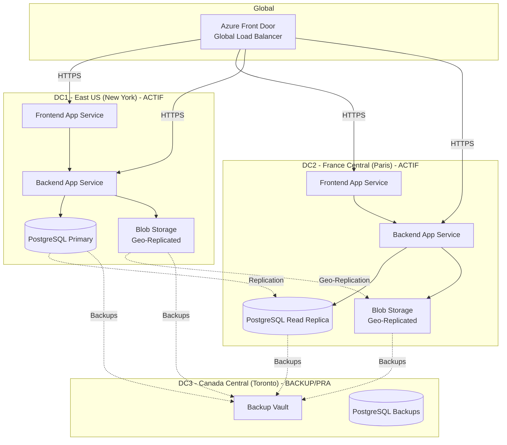
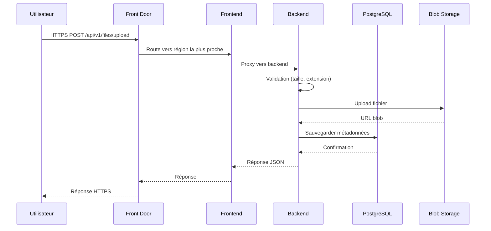
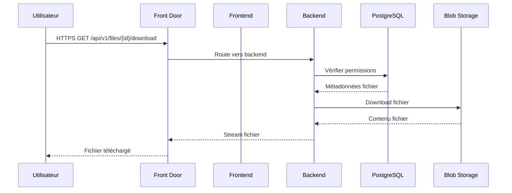

# Architecture SUPFile - Azure Multi-Régions

## Vue d'ensemble

SUPFile est déployé sur **Microsoft Azure** avec une architecture multi-régions pour assurer haute disponibilité, performance et résilience.

## Architecture Multi-Régions



## Composants

### 1. Azure Front Door

**Rôle** : Point d'entrée global, distribution du trafic

- **Routage** : Distribution géographique du trafic
- **SSL/TLS** : Terminaison HTTPS avec certificats gérés
- **WAF** : Protection contre les attaques (OWASP Top 10)
- **Cache** : Mise en cache des ressources statiques
- **Health Checks** : Vérification de santé des backends

**Configuration** :
- Routing basé sur la latence
- Failover automatique en cas de panne
- Load balancing entre East US et France Central

### 2. Frontend (React + Nginx)

**Déploiement** : Azure App Service (ou AKS)

- **Technologies** : React 18, TypeScript, Vite
- **Reverse Proxy** : Nginx
- **Build** : Docker container
- **Scaling** : Auto-scaling basé sur la charge

**Régions** :
- East US (New York) - Instance active
- France Central (Paris) - Instance active

### 3. Backend (FastAPI)

**Déploiement** : Azure App Service (ou AKS)

- **Technologies** : FastAPI, Python 3.11
- **API** : RESTful API avec documentation OpenAPI
- **Authentication** : JWT tokens
- **Scaling** : Auto-scaling horizontal

**Régions** :
- East US (New York) - Instance active
- France Central (Paris) - Instance active

### 4. Base de données (PostgreSQL)

**Service** : Azure Database for PostgreSQL

- **Primary** : East US
  - Écritures et lectures
  - Réplication vers France Central
  
- **Read Replica** : France Central
  - Lectures uniquement
  - Réduction de la latence pour les utilisateurs européens
  
- **Backups** : Canada Central
  - Backups quotidiens automatiques
  - Rétention : 30 jours
  - Point-in-time recovery

**Configuration** :
- Version : PostgreSQL 15
- Tier : General Purpose
- Storage : 100GB (auto-grow activé)
- SSL : Obligatoire

### 5. Stockage de fichiers (Azure Blob Storage)

**Service** : Azure Blob Storage avec Geo-Replication

- **Container** : `supfile-files` (privé)
- **Geo-Replication** : LRS → GRS (East US ↔ France Central)
- **Accès** : Privé uniquement (pas d'accès public)
- **SAS Tokens** : Pour téléchargements temporaires si nécessaire

**Structure** :
```
supfile-files/
  ├── {user_id}/
  │   ├── {uuid}/
  │   │   └── {filename}
```

### 6. Authentification & Sécurité

- **JWT Tokens** : Access tokens (30 min) + Refresh tokens (7 jours)
- **Password Hashing** : bcrypt (12 rounds)
- **HTTPS** : Obligatoire partout (TLS 1.2+)
- **CORS** : Configuré pour les origines autorisées
- **Input Validation** : Pydantic pour le backend
- **Rate Limiting** : Au niveau de Nginx/Azure Front Door

### 7. Monitoring & Logs

**Services** :
- **Azure Monitor** : Métriques et alertes
- **Application Insights** : Télémétrie applicative
- **Log Analytics** : Centralisation des logs

**Métriques surveillées** :
- Latence des requêtes
- Taux d'erreur
- Utilisation CPU/Mémoire
- Espace de stockage Blob
- Connexions base de données

### 8. Plan de Reprise d'Activité (PRA)

**RPO (Recovery Point Objective)** : 1 heure
- Backups incrémentiels toutes les heures
- Backups complets quotidiens

**RTO (Recovery Time Objective)** : 4 heures
- Temps de restauration depuis Canada Central
- Procédure documentée et testée

**Stratégie** :
1. **Backups automatiques** vers Canada Central
2. **Geo-replication** Blob Storage (East US ↔ France Central)
3. **Read Replica** PostgreSQL (France Central)
4. **Failover automatique** via Azure Front Door

**Scénarios de sinistre** :

| Scénario | Impact | Récupération |
|----------|--------|--------------|
| Panne East US | Trafic routé vers France Central | Automatique (< 5 min) |
| Panne France Central | Trafic routé vers East US | Automatique (< 5 min) |
| Panne complète (East US + France Central) | Activation PRA Canada Central | Manuelle (4 heures) |
| Perte de données | Restauration depuis backups | Point-in-time recovery |

## Flux de données

### Upload de fichier



### Download de fichier



## Sécurité

### Couches de sécurité

1. **Réseau** :
   - Azure NSG (Network Security Groups)
   - Azure Firewall
   - Private Endpoints pour base de données

2. **Application** :
   - JWT authentication
   - Input validation
   - CORS restrictions
   - Rate limiting

3. **Données** :
   - Chiffrement au repos (Azure Storage)
   - Chiffrement en transit (TLS 1.2+)
   - Secrets dans Azure Key Vault

4. **Infrastructure** :
   - WAF (Web Application Firewall) sur Front Door
   - DDoS Protection
   - Security Center monitoring

## Performance

### Optimisations

- **CDN** : Azure Front Door pour cache statique
- **Database Connection Pooling** : SQLAlchemy pool
- **Blob Storage** : Accès direct avec SAS tokens si nécessaire
- **Read Replicas** : Réduction latence pour lectures

### Métriques cibles

- **Latence API** : < 200ms (p95)
- **Upload fichier** : Dépend de la taille et connexion
- **Download fichier** : Streaming pour gros fichiers
- **Disponibilité** : 99.9% (SLA Azure)

## Coûts estimés (mensuel)

*Note : Coûts indicatifs, à ajuster selon usage réel*

- **App Service** (2 régions) : ~$100-200
- **PostgreSQL** (Primary + Replica) : ~$150-300
- **Blob Storage** (100GB + geo-replication) : ~$20-50
- **Front Door** : ~$50-100
- **Backup Vault** : ~$10-20
- **Monitoring** : ~$20-50

**Total estimé** : ~$350-720/mois

## Évolutivité

### Scaling horizontal

- **Frontend/Backend** : Auto-scaling basé sur CPU/Mémoire
- **Database** : Read replicas supplémentaires si nécessaire
- **Blob Storage** : Scaling automatique

### Scaling vertical

- Upgrade des tiers App Service si nécessaire
- Upgrade PostgreSQL (plus de vCores, plus de mémoire)

## Prochaines étapes

1. ✅ Architecture multi-régions
2. ✅ Dockerisation
3. ✅ Configuration Azure
4. 🔄 Tests de charge
5. 🔄 Monitoring avancé
6. 🔄 Extension mobile (futur)

